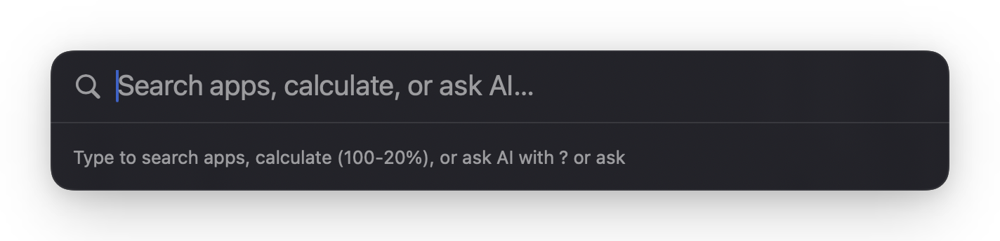
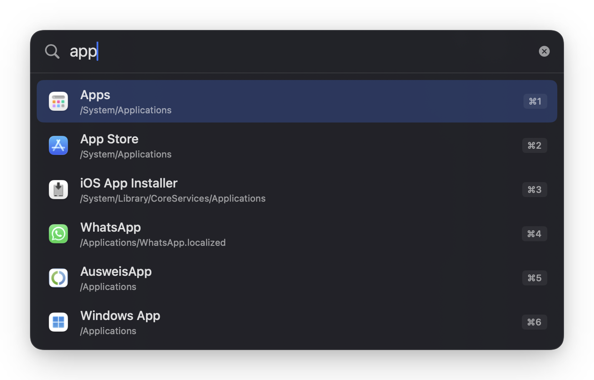
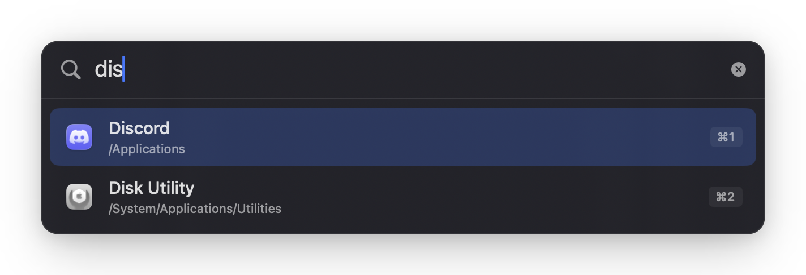
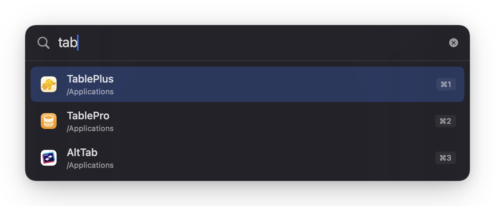
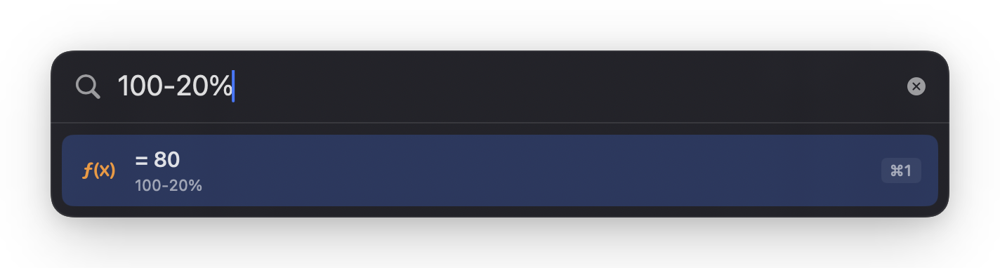
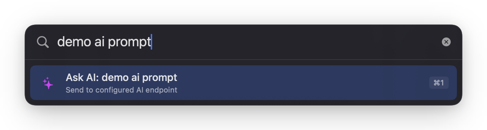
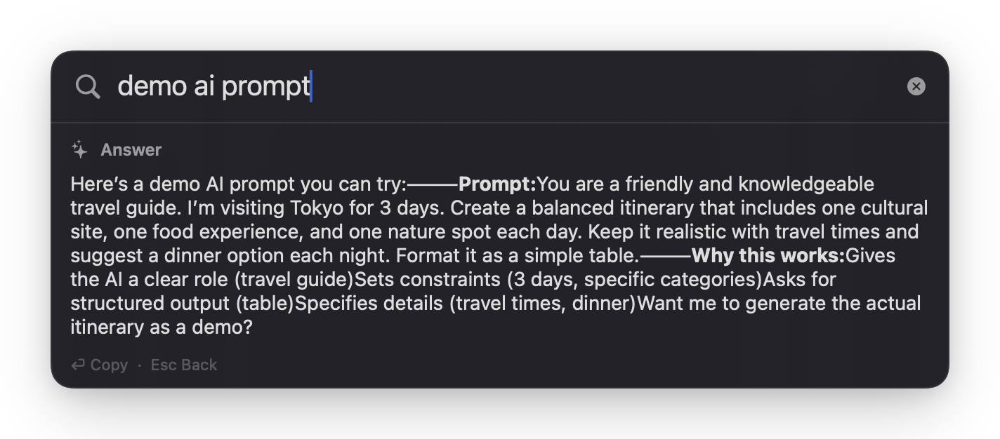

# Simple Launcher

A minimal Alfred/Sol-style macOS launcher built with native SwiftUI.

## Features

- **App launcher** — fuzzy search installed apps, open with Return or ⌘1–⌘9
- **Calculator** — math in the search field, including percentages (`100-20%` → `80`)
- **Ask AI** — OpenAI-compatible chat; trigger with `?` / `ask `, or as a fallback when nothing matches
- **Launch at login** — optional startup via Settings

## Screenshots

<p align="center">
  
</p>

<p align="center">
  
  <br />
  <em>Fuzzy app search — <code>app</code></em>
</p>

<p align="center">
  
  <br />
  <em>Fuzzy app search — <code>dis</code></em>
</p>

<p align="center">
  
  <br />
  <em>Fuzzy app search — <code>tab</code></em>
</p>

<p align="center">
  
  <br />
  <em>Inline calculator</em>
</p>

<p align="center">
  
  <br />
  <em>Ask AI fallback</em>
</p>

<p align="center">
  
  <br />
  <em>Ask AI answer</em>
</p>

## Requirements

- macOS 14+ (Apple Silicon)
- Xcode 15+

## Build & run

```sh
./build.sh
```

Builds a Debug app under `build/DerivedData/`.

Pass `Release` to build and install to `/Applications`:

```sh
./build.sh Release
```

Or open in Xcode:

```sh
open SimpleLauncher.xcodeproj
```

Select the **SimpleLauncher** scheme and press Run.

The app runs as a menu bar accessory (no Dock icon).

## Usage

| Action | How |
| --- | --- |
| Toggle launcher | **⌥ Space** (Alt+Space), or menu bar → Show Launcher |
| Launch app | Type name → Return / click / ⌘1–⌘9 |
| Calculate | Type `100-20%` → Return copies result |
| Ask AI (prefix) | `? your question` or `ask your question` |
| Ask AI (fallback) | Type something with no app matches → select Ask AI |
| Settings | Menu bar → Settings…, or **⌘,** |
| Launch at login | Settings → Launch at login |
| Dismiss | Esc or click outside |

### Ask AI settings

In Settings, configure:

1. **Endpoint** — e.g. `https://api.openai.com/v1` or `https://opencode.ai/zen/go/v1/chat/completions`
2. **API key** — stored in UserDefaults (personal use; no Keychain prompts)
3. **Model name** — e.g. `deepseek-v4-flash`

Requests go to `{endpoint}/chat/completions` (OpenAI-compatible streaming).

AI answers appear in an inline markdown pane under the search field. **Return** copies the plain-text answer; **Esc** exits answer mode.

## Notes

- App Sandbox is off so the launcher can open apps and call custom AI endpoints.
- If Alt+Space does not work, another app may already own that hotkey (e.g. Spotlight alternatives).
